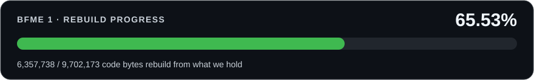

# BFME 1 Source Code


Goal: Source code that rebuilds BFME 1's executable byte-for-byte, and game modernization improvements that you've only seen in your dreams.

[Join our Discord to participate!](https://discord.gg/wCvA2XqPUT)

## What?

* If you take a part of the BFME binary, recreate the exact source code that would make that part of the binary, then compile the source code and inject it into the binary, you get the same binary
* Doing this piece by piece will eventually give you a full, open source recreation of BFME, and enable some (insane) mods

[](tools/progress.py)

## Status

The bar above tracks source that rebuilds from what this repository holds.
Game source lives in `game/`, WorldBuilder source in `worldbuilder/`, and their
separate recovery ledgers in `targets/`. Original binaries, toolchains and
reference sources live in `inputs/`; mods remain in `mods/`.

## Roadmap

* [ ] BFME 1 Source Code (see the live progress bar above)
* [x] Network delay fix
* [ ] Memory fix
* [ ] Better crash logs
* [ ] 60/120 FPS
* [ ] Multi CPU
* [ ] AC fix
* [ ] World builder Source Code
* [ ] 16 player maps

## How You Can Help

Clone the repo and give your AI agent this exact prompt — measured on six agent
sessions, a vaguer prompt reliably produces zero progress:

> Read AGENTS.md and follow it. Loop: take the served candidate's whole file,
> convert bodies to byte-exact C++, bank each verified body as its own commit,
> and before stopping run `python3 tools/progress.py origin/master` — if C++
> exact is +0 bytes, keep going. Make a PR when you have a few landed bodies.

Each commit in the PR is one verified function, and I will be able to merge it.

!! All such AI-generated PRs are appreciated !!

## Build

The MSVC 7.1 toolchain and baseline executables are committed directly (plain git, no LFS), so a normal `git clone` gets everything. Then:

```bash
./tools/setup_hooks.sh   # enable the pre-commit byte-check (git won't do this from a clone)
./build.sh               # verify every tracked function against retail   (build.cmd or .\build.ps1 on Windows, same arguments)
```

On Linux, use WineHQ's Wine 11 (`winehq-stable`), not a distro package, with a
32-bit prefix (`WINEARCH=win32 wineboot -i`). Ubuntu 24.04's Wine 9.0 compiles
almost everything, but `cl.exe` spins forever on a few TUs (among them
`WW3D2/Rva0093C4A0.cpp`, `System/RegistryUserDataLeafNameUnicode.cpp` and
`GameNetwork/NetPacket_ConstructBigCommandPacketList.cpp`), so a full gate
never finishes. Under Wine 11 the same full gate runs in about 30 minutes on
four cores.

To check a single function while iterating, pass its file or name — a few seconds instead of the full run:

```bash
./build.sh game/Libraries/Source/WWVegas/WWMath/color.cpp
```
