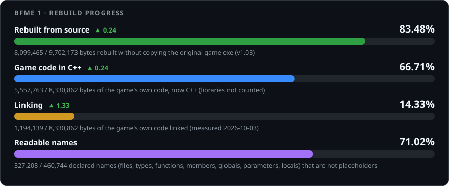
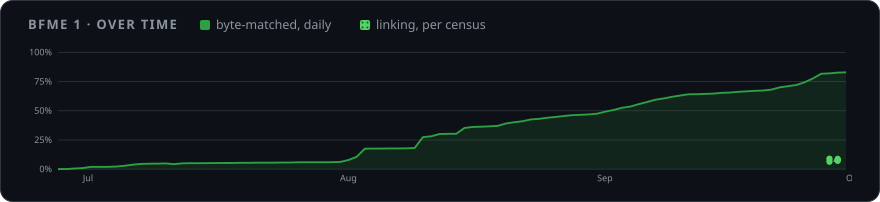
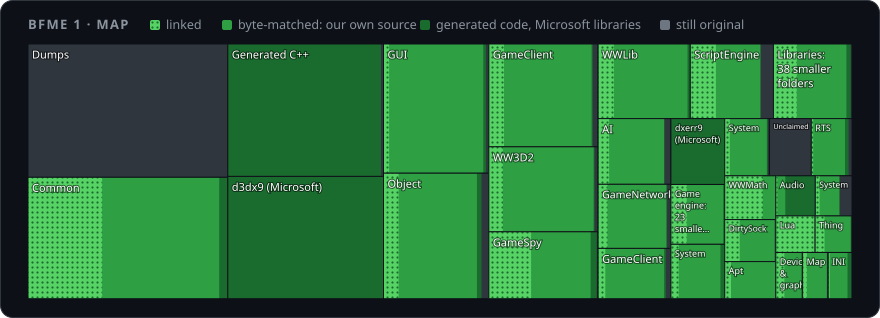

# BFME 1 Source Code


Goal: rebuild BFME 1's retail executable byte for byte from source, and use that source to fix and improve the game.

[Join our Discord to participate!](https://discord.gg/wCvA2XqPUT)

## What?

* We rewrite the game's code as C++, one small piece at a time.
* Each piece must rebuild to the exact bytes of the original game exe (BFME 1, version 1.03).
* When every piece matches and links, the whole game is open source, and we can fix bugs and make mods.

[](tools/progress.py)

### What the bars measure

* **Rebuilt from source**: code rebuilding to the original exe's exact bytes, partly generated code or prebuilt libraries.
* **Game code in C++**: the game's own code (no libraries) in C++.
* **Linking**: the part of that code in files that link cleanly (link census).

<details open>
<summary><b>Progress over time and code map</b></summary>

[Interactive report](https://open-bfme.github.io/Open-BFME-1/)





</details>

## Status

Source: `game/` and `worldbuilder/`, with their ledgers in `targets/`. Original
binaries, toolchains and references: `inputs/`. Mods: `mods/`.

## Roadmap

* [ ] BFME 1 Source Code
* [x] Network delay fix
* [ ] Memory fix
* [ ] Better crash logs
* [ ] 60/120 FPS
* [ ] Multi CPU
* [ ] [AC fix](mods/features/055-ac-attack-view/README.md) (live-tested for the reported case; opt-in until other horde fights are tested)
* [ ] World builder Source Code
* [ ] 16 player maps

## How You Can Help

Give your AI agent this exact prompt; in six measured sessions a vaguer one
produced zero progress:

> Read AGENTS.md and follow it. Loop: take the served candidate's whole file,
> convert bodies to byte-exact C++, bank each verified body as its own commit,
> and before stopping run `python3 tools/progress.py origin/master` — if C++
> exact is +0 bytes, keep going. Make a PR when you have a few landed bodies.

Each commit in the PR is one verified function, and I will be able to merge it.

!! All such AI-generated PRs are appreciated !!

## Build

The MSVC 7.1 toolchain and baseline executables are committed (no LFS), so `git clone` gets everything. Then:

```bash
./tools/setup_hooks.sh   # enable the pre-commit byte-check (git won't do this from a clone)
./build.sh               # verify every tracked function against retail   (.\build.cmd on Windows, same arguments)
```

On Linux, use WineHQ's Wine 11 (`winehq-stable`) with a 32-bit prefix
(`WINEARCH=win32 wineboot -i`); Ubuntu 24.04's Wine 9.0 hangs `cl.exe` on a few files. A full
gate takes about 30 minutes on four cores.

To check one function in seconds, pass its file or name:

```bash
./build.sh game/Libraries/Source/WWVegas/WWMath/color.cpp
```
