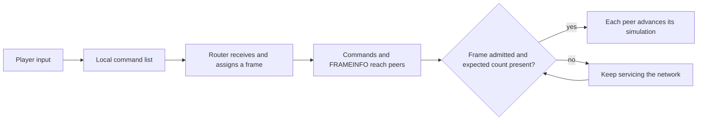

# How BFME1 multiplayer lockstep works

This checkout reconstructs the BFME1 executable, using the Workshop vanilla
1.03 baseline. RotWK is a related engine, but its patch constants and binary
addresses cannot be transferred to this executable without separate evidence.
The explanation below follows the retail callers and recovered C++.

## One battle, simulated on every computer

Each player runs the simulation locally. The network sends orders and control
messages; it does not continuously send every unit's position as the authority
for the other machines. Matching initial state, random state, update rules and
command order let every machine calculate the same battle.

Think of a frame as a numbered page of orders. If frame 120 contains two move
orders and one build order, every player must execute that page with the same
contents and ordering. A player who has only two of its three orders must wait.
Running an incomplete page would risk a different battle on that computer.

The packet router coordinates distribution and frame progress. It is not the
only machine calculating combat. The receive loop runs on every peer; routing
and departure duties add work when the local peer is the router.

## From a click to an executed command

1. `Network::GetCommandsFromCommandList` wraps gameplay messages for networking.
   An original guest command starts with execution frame `-1`.
2. The guest sends it toward the router. The router assigns an unbound command
   its current logic frame; its own local-send path uses `max(currentFrame, 2)`.
   There is no unconditional `currentFrame + NetworkRunAheadSlack` assignment.
3. `Connection::sendNetCommandMsg` queues a reference. Oversized messages are
   split into wrapper commands, so individual pieces can be retried.
4. `Connection::doSend` builds packets and sends due references. ACKs retire
   deliveries; timeouts make retained references eligible to be sent again.
   Duplicate filtering uses message identity, not allocation address.
5. Commands enter the frame history. `FRAMEINFO` supplies the frame and expected
   command count. BFME's readiness check compares the aggregate received count
   across participating frame-data managers with the announced expected count.
   An unknown expected count (`-1`) is different from a known empty frame (`0`).
6. At the admitted simulation phase, commands are relayed into the execution
   list. Preserve the recovered insertion rules: BFME has combined comparisons
   and fast paths, not simply the Zero Hour lexicographic loop.

The principal readable sources are
[the command pump](../game/GameEngine/Source/GameNetwork/Network_GetCommandsFromCommandList.cpp),
[enqueue/fragmentation](../game/GameEngine/Source/GameNetwork/Connection_sendNetCommandMsg.cpp),
[packet sending](../game/GameEngine/Source/GameNetwork/Connection_doSend.cpp),
[frame storage](../game/GameEngine/Source/GameNetwork/FrameData.cpp),
[command insertion](../game/GameEngine/Source/GameNetwork/NetCommandList_addMessage.cpp),
and [routing/readiness](../game/GameEngine/Source/GameNetwork/native_connection_timing.cpp).

## Why there is delay even on a fast network

Retail's router admission quantum is `QueryPerformanceFrequency / 5`: 200 ms.
The engine divides work into six phases and asks for network admission at phase
one. The caller tests a positive allowance as permission for one phase-one
advance; it does not loop over the returned allowance as a batch size. The
logic-frame counter advances on that phase. Client work occupies the other
phases, so this is not a claim that rendering runs at five frames per second.

A guest is also constrained by the router's announced frame ceiling and command
completeness. These scheduling waits are added to transmission, processing and
any loss recovery. Thus 200 ms is a scheduling quantum, not a universal
click-to-action measurement or a substitute for ping.

`NetworkRunAheadSlack` is used in retained-frame/stale-command checks. A setting
of 10 at five logic frames per second corresponds to two seconds of nominal
simulation age, but a stalled simulation does not age frames like a wall clock.
Read each installation's INI archives before quoting configurable values.

See [the caller and phase evidence](bfme1-network-admission-and-client-phases.md)
and the recovered [admission function](../game/GameEngine/Source/GameNetwork/BFMENativeNetwork_getFrameAdvanceCount.cpp).

## Loss, leaving and router replacement

Timer retries are not the only recovery mechanism. During router departure,
`INFORMPLAYERLEAVEFRAME` can cause a peer to request a frame range with type 9
`REQUESTFRAMEDATA`. The responder sends retained command payloads and fresh
frame-count messages. Disconnect-frame synchronization also invokes this
resender. The ordinary readiness equality test does not itself poll for missing
commands using Zero Hour's tri-state resend protocol.

History replay cannot recreate an original guest command lost before the router
received and archived it. That command still needs sender retries. Similarly,
a missing command may stall the game without producing a checksum mismatch.

The recovered type 22 message carries a ranked list of player IDs for router
fallback. Unused entries are `-1` in the producer, `0xFF` on the wire, and
read back as unsigned 255. These entries are player IDs or padding, not
latency or frame-ratio measurements.
The disconnect path consumes that ordering to select a successor. Several old
names in the repository predate this producer/consumer identity reconstruction.

## How desync is detected

The game also checks whether peers still calculate the same state. The recovered
`GameLogic::getCRC` gathers subsystem state, and the peer-report handler retains
reports by frame and player, waits for the relevant reports, and compares them.
A difference is reported as a synchronization failure; this is detection, not
an implemented rollback or automatic state repair.

There is a separate local guard that checks for simulation changes outside
`GameLogic::update`. Do not confuse that guard with cross-player comparison.
The checksum accumulator's implementation is a rotate/add over words and tail
bytes despite the historical CRC name.

Readable evidence includes
[state collection](../game/GameEngine/Source/Common/GameLogicCRC.cpp),
[peer comparison](../game/GameEngine/Source/GameLogic/System/GameLogicPeerCRC.cpp),
and [the local guard](../game/GameEngine/Source/GameNetwork/native_desync_report.cpp).
Object registration, wake-up scheduling and deferred destruction matter here:
all peers must update the same objects in the same phases and order.

## What the repository already contains

The reconstructed protocol includes timing/admission, command packaging,
frame history and ordering, routing, ACK/duplicate handling, retransmission,
file transfer, departure recovery and checksum comparison. Some surrounding
bodies remain assembly or banked near-matches. A ledger match, a full repository
build and a successful multiplayer session are different levels of evidence.

The packaged executable in `mods/dist` also already includes two latency
changes: `031-earlysend` drains guest commands from the client update path,
and `033-retrytime` changes the constructor's retry interval from 2000 to
400 ms. On 2026-09-07 the executable's SHA256 matched its manifest; the detour
at RVA `0x0006BA44` and the 400 ms operand at `0x006623DE` were checked directly.
This verifies the packaged changes, not a new live-match performance result.

`034-framedrain` is a separate rejected experiment: its recorded trials desynced
and it is absent from the packaged feature list. `035-adaptretry` is closed and
not built. Faster command sending and more aggressive simulation advancement
must therefore be evaluated separately.

[Network fixes](net-fixes.md) records the earlier two-client latency/loss trials
and their limits. The 2026-09-07 reconstruction session has not rerun those
matches. The user-supplied
[RotWK delay-fix article](https://www.gamereplays.org/riseofthewitchking/portals.php?show=page&name=rotwk_2.02_delay_fix)
is useful related context; the direct page was unavailable during this review,
so its specific implementation is not asserted here.
