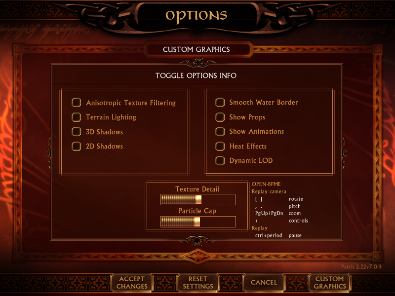

# 048-advancedgfx — BFME's own Custom Graphics tab, which 2.22 never opens

Eleven graphics settings ship inside BFME1, finished on both sides, and the
retail game has no way to reach any of them. This turns them on.

The eleven settings are BFME's own, bound to its own load and save code. The
CUSTOM GRAPHICS button and the OPEN-BFME block are ours, both placed into
`Options.apt` by `apt_panel.py`.

| | |
|---|---|
| Anisotropic Texture Filtering | Smooth Water Border |
| Terrain Lighting | Show Props |
| 3D Shadows | Show Animations |
| 2D Shadows | Heat Effects |
| Dynamic LOD | |
| Texture Detail *(slider)* | Particle Cap *(slider)* |

**SHIPPED** in `mods/dist`. A **CUSTOM GRAPHICS** button sits in the Options nav
bar beside CANCEL. Click it for the tab, click it again to come back. F11 does
the same thing from the keyboard.

This mod is two files. `mods/dist/lotrbfme.exe` carries the code and
`mods/dist/apt/options.big` carries the button and the panel text -- install one
without the other and either the button does not exist or it does nothing.

## Why this is one call and not a mod

`Options.apt` carries the whole tab — eleven widgets, their labels, their
tooltips and an animated open and close, at frames 102..121 behind the label
`_open_advanced`. The engine side is finished too: every one of the eleven has a
slot on the screen object, a line in `AptOptions::Save` and a line in the load
path. Even the navigation exists.

    AptOptions::showAdvanced   RVA 0x0055DBA0   __thiscall(screen)

Nothing in the game calls it. That one function does both halves — it calls
`assignOpen("advanced")` on the movie through `WindowManager::callFunction`, and
it sets the screen state to 4.

**Both halves matter.** `AptOptions::InitGadgets` (RVA `0x005625C0`) is not a
lookup: it is the callback the APT runtime invokes per gadget as that gadget is
created, and its compare-and-store chain runs only when the state reads 4. Play
the movie without setting the state and the tab draws with nothing bound to it.

Going back needs no logic of its own. `AptOptions::update` opens a tab only out
of state 1, so dropping the state to 1 hands the screen to the game's own code
and it reopens the normal tab on its next frame.

## Measured, not assumed

The screen object's widget slots were read directly, through 047-uiprobe's F10
dump, on the live screen:

| | normal tab | after F11 |
|---|---|---|
| state (`screen+0x258`) | 2 | **4** |
| `HealthBars` — the control | non-null | non-null |
| all eleven advanced slots | **0** | **all non-null** |

`HealthBars` is the control: it is an authored widget that visibly loads its
value, so a run where it read null would mean the dump was wrong rather than the
registration.

Then end to end, with `HeatEffects = yes` in `Options.ini` and every other
advanced setting off: **Heat Effects came up as the one ticked box.** So
registration, the game's load path and the render are all proved together, and
`Save` writes them back through code that was already there.

## The button, and the Open-BFME block

`apt_panel.py` builds both, through `tools/aptfile.py`, without moving a byte of
the original movie.

The nav bar is sprite 147 and it places ONE character -- 146 -- three times,
telling Save, Reset and Cancel apart only by the instance name on each
placement. **A click dispatches on that name**: named `RefreshNat` the click
arrives at `AptOptions::RefreshNat`, measured as `{"hit":"RefreshNat","state":2}`
on a real mouse click. So the button costs one placement and one detour, and it
inherits the art, the hover glow and the click sound because it *is* the button
the other three are.

Its label is two text characters of our own, on two lines -- what ACCEPT CHANGES
and RESET SETTINGS do, and a fifteen-character label does not fit this button on
one line. They carry **font `0x1e` at 16pt, 19.2 units apart**, which puts them
on the same rows as the authored labels (561-568 and 576-583 on an 800x600
render). An earlier pass reused the tab title's character, font `0xa` at 18pt,
and the wrong face was obvious on sight.

A button's own label cannot be set instead: it binds to the ActionScript
variable `_parent._parent.buttonName`, which appears nowhere in the executable.
Its placeholder has to be cleared, and it is drawn **twice** -- character 140 is
the dark shadow, 130 the light face -- both carrying `"...\r...."`. The
carriage return is why a first attempt cleared 31 and 46, which look like the
placeholders to any scan that filters on printable strings and belong to a
different button style.

The tab's panel has an empty column right of the slider box, and that is where
Open-BFME says what it has added -- the replay camera keys and the replay pause,
in the screen's own fonts and colours. Each row is two text characters at two x
positions, because the UI font is proportional and padding one string with
spaces does not line a column up. Every line is a feature actually shipped in
`mods/dist`; drop one from the build and its line comes out of `LINES`.

## Where the button is placed, and why not on the nav bar

On the movie's own tab frames -- 29 where the normal tab rests and 120 where the
advanced one does -- not inside the shared nav sprite. Both look identical, and
the nav sprite is the obvious place, but it is drawn on **every** tab including
the online one. The online tab has the game's own Refresh NAT button, which
carries the very command ours does, and the handler cannot tell two buttons
apart. Placing ours only where those two tabs rest leaves the online tab's
button unambiguous.

## The detour swallows the call

Sharing `AptOptions::RefreshNat` is only safe because the detour can suppress
it. `PE.shim`'s `swallow_ret` turns a detour into a conditional replacement: the
payload returns non-zero to say it handled the call and the shim returns to the
caller with `ret 4` instead of running the function at all. Returning zero falls
through to the original, which is what happens on the online tab.

Without it the real handler ran after ours and kicked a genuine NAT refresh --
not theoretical, it wrote `FirewallNeedToRefresh` and
`FirewallPortAllocationDelta` into `Options.ini`. Measured after the change:
two clicks and an ACCEPT CHANGES, and neither key came back.
