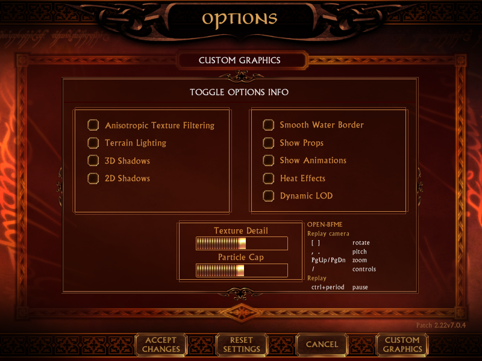

# 048-advancedgfx: opens BFME's hidden Custom Graphics tab

Eleven graphics settings ship inside BFME1, finished on both sides, and retail
2.22 has no way to reach any of them. This adds a **CUSTOM GRAPHICS** button to
the Options nav bar, beside CANCEL: click it for the tab and again to come back.
F11 does the same from the keyboard. It is in the repository bundle,
`mods/dist`.

| | |
|---|---|
| Anisotropic Texture Filtering | Smooth Water Border |
| Terrain Lighting | Show Props |
| 3D Shadows | Show Animations |
| 2D Shadows | Heat Effects |
| Dynamic LOD | |
| Texture Detail *(slider)* | Particle Cap *(slider)* |

The eleven settings are BFME's own, bound to its own load and save code. The
button and an OPEN-BFME block, which lists the bundle's replay camera keys and
replay pause, are added to `Options.apt` by `apt_panel.py`.

## Install both files

`mods/dist/lotrbfme.exe` carries the code and `mods/dist/apt/options.big`
carries the button and the panel text. Install one without the other and either
the button does not exist or it does nothing. `python3 tools/modbuild.py --dist`
builds both.

## How it works

`Options.apt` already holds the whole tab (frames 102..121, behind the label
`_open_advanced`), and every setting already has a slot on the screen object, a
line in `AptOptions::Save` and a line in the load path. Nothing in the game calls
`AptOptions::showAdvanced` (RVA `0x0055DBA0`), which opens that tab and sets the
screen state to 4. Both halves matter: `AptOptions::InitGadgets` (RVA
`0x005625C0`) binds the widgets only in state 4. Going back drops the state to 1,
and the game's own code reopens the normal tab.

The button is another placement of the nav bar's own button character, named
`RefreshNat`, so it inherits the art, hover glow and click sound, and its clicks
arrive at `AptOptions::RefreshNat`. A detour there handles the click and, through
`PE.shim`'s `swallow_ret`, skips the original, so no NAT refresh runs. It is
placed only on the tab frames where the normal and advanced tabs rest (29 and
120), never on the online tab, whose own Refresh NAT button must keep working.

## Verified

Read on the live screen with `047-uiprobe`: after F11 the screen state is 4 and
all eleven widget slots are non-null, against zero on the normal tab. With
`HeatEffects = yes` in `Options.ini` and every other advanced setting off, Heat
Effects came up as the one ticked box, so registration, loading and rendering
work together, and `Save` writes the settings back. Two clicks and ACCEPT
CHANGES wrote neither `FirewallNeedToRefresh` nor `FirewallPortAllocationDelta`
to `Options.ini`.
